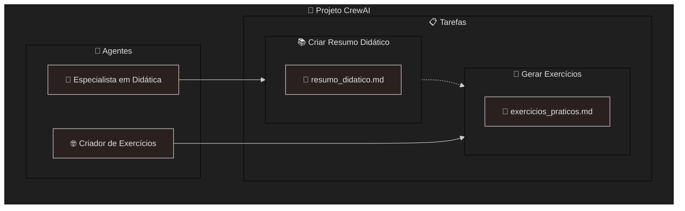

# Confguração de Tarefas e Papéis em CrewAI

Este curso explora a confguração de tarefas e papéis no CrewAI, mostrando como defnir fuxos de trabalho inteligentes
e atribuir responsabilidades a diferentes agentes. Ao fnal, você será capaz de criar tarefas, atribuir papéis e orquestrar interações
entre múltiplos agentes. Destinado a iniciantes, o curso é essencial para quem deseja construir soluções colaborativas e efcientes.
Você começará entendendo a diferença entre tarefas e papéis no contexto do CrewAI. Em seguida, aprenderá a confgurar tarefas
com parâmetros, condições e objetivos claros. O curso detalha a atribuição de papéis, permitindo que agentes assumam funções
específcas em diferentes cenários. Por fm, você verá exemplos de fuxos de trabalho colaborativos e dicas para monitorar e ajustar
a performance dos agentes. Ao concluir, você estará apto a criar projetos CrewAI com múltiplos agentes, promovendo colaboração
e automação inteligente.

Subcompetência: `Confguração de Tarefas e Papéis`

Pré-requisitos: `Criação de Agentes`

Aulas:
1. Introdução à Confguração de Tarefas e Papéis em CrewAI
2. Diferença Entre Tarefas e Papéis no CrewAI
3. Confguração de Tarefas com Parâmetros e Objetivos
4. Atribuição de Papéis e Orquestração de Agentes
5. Monitoramento e Ajustes em Tarefas e Papéis

Conquistas:
- Ao concluir este curso, você será capaz de defnir tarefas e papéis para agentes em CrewAI.
- Aprimore suas habilidades em CrewAI através da Confguração de Tarefas e Papéis.
- Conquiste a Badge Confguração de Tarefas e Papéis em CrewAI
- Receba o Certifcado de Conclusão para Confguração de Tarefas e Papéis em CrewAI

## Prática Guiada no Google Colab

Durante o curso, todas as práticas foram organizadas em um notebook interativo no Google Colab. Você pode executar os códigos diretamente do seu navegador, sem precisar instalar nada:

Na prática, desenvolvemos o seguinte projeto de Agentes Inteligentes neste curso:

