# Confguração de Tarefas e Papéis em CrewAI

Este curso explora a confguração de tarefas e papéis no CrewAI, mostrando como defnir fuxos de trabalho inteligentes
e atribuir responsabilidades a diferentes agentes. Ao fnal, você será capaz de criar tarefas, atribuir papéis e orquestrar interações
entre múltiplos agentes. Destinado a iniciantes, o curso é essencial para quem deseja construir soluções colaborativas e efcientes.
Você começará entendendo a diferença entre tarefas e papéis no contexto do CrewAI. Em seguida, aprenderá a confgurar tarefas
com parâmetros, condições e objetivos claros. O curso detalha a atribuição de papéis, permitindo que agentes assumam funções
específcas em diferentes cenários. Por fm, você verá exemplos de fuxos de trabalho colaborativos e dicas para monitorar e ajustar
a performance dos agentes. Ao concluir, você estará apto a criar projetos CrewAI com múltiplos agentes, promovendo colaboração
e automação inteligente.

Subcompetência: `Confguração de Tarefas e Papéis`

Pré-requisitos: `Criação de Agentes`

Aulas:
1. Introdução à Confguração de Tarefas e Papéis em CrewAI
2. Diferença Entre Tarefas e Papéis no CrewAI
3. Confguração de Tarefas com Parâmetros e Objetivos
4. Atribuição de Papéis e Orquestração de Agentes
5. Monitoramento e Ajustes em Tarefas e Papéis

Conquistas:
- Ao concluir este curso, você será capaz de defnir tarefas e papéis para agentes em CrewAI.
- Aprimore suas habilidades em CrewAI através da Confguração de Tarefas e Papéis.
- Conquiste a Badge Confguração de Tarefas e Papéis em CrewAI
- Receba o Certifcado de Conclusão para Confguração de Tarefas e Papéis em CrewAI

## Prática Guiada no Google Colab

Durante o curso, todas as práticas foram organizadas em um notebook interativo no Google Colab. Você pode executar os códigos diretamente do seu navegador, sem precisar instalar nada:

Na prática, desenvolvemos o seguinte projeto de Agentes Inteligentes neste curso:

```mermaid
---
config:
  layout: dagre
  theme: neo-dark
---
flowchart TD
  subgraph C["🤖 Projeto CrewAI"]
    subgraph Agentes["👥 Agentes"]
      ED["🧐 Especialista em Didática"]
      CE["🤓 Criador de Exercícios"]
    end
    
    subgraph Tarefas["📋 Tarefas"]
      subgraph T1["📚 Criar Resumo Didático"]
        O1["📄 resumo_didatico.md"]
      end
      subgraph T2["🎯 Gerar Exercícios"]
        O2["📄 exercicios_praticos.md"]
      end
    end
  end
  
  ED --> T1
  T1 -.-> T2
  CE --> T2
  
```

